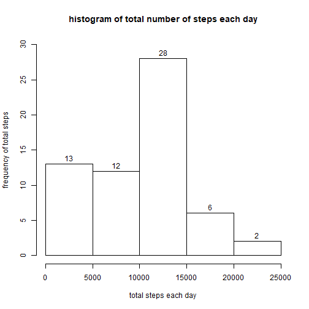
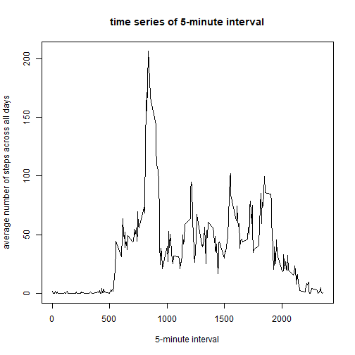
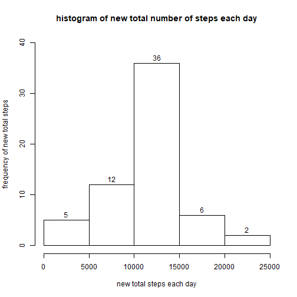
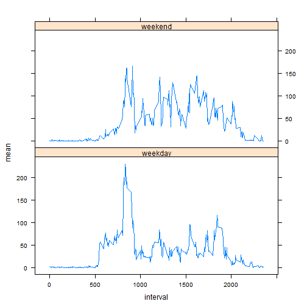

##Reproducible Research Week2 Project

##1.Loading and preprocessing the data:
(1)download and unzip the dataset, read it into a file.
```{r}

fileurl<- "https://d396qusza40orc.cloudfront.net/repdata%2Fdata%2Factivity.zip"
if(!file.exists("data")) {dir.create("data")}
download.file(fileurl, destfile="./data/repdata.zip")
zipfile<- "./data/repdata.zip"
unzip(zipfile, exdir= "./data")
data<- read.csv("./data/activity.csv")

```

##2.What is mean total number of steps taken per day?
(1)calculate mean, median and total numbers of steps per day;
(2)make a histogram plot for the total number of steps taken each day.
```{r}

total<- tapply(data$steps,data$date,sum,na.rm=TRUE)

hist(total,ylim=c(0,30),main="histogram of total number of steps each day",xlab="total steps each day",ylab="frequency of total steps",labels=TRUE)

sum<- tapply(data$steps,data$date,sum,na.rm=TRUE)
mean(sum)
# 9354.23
median(sum)
# 10395

```
Q: Calculate and report the mean and median of the total number of steps taken per day
Answer: mean= 9354.23, median=10395.





##3.What is the average daily activity pattern?
(1)make a time series plot of the 5-minute interval (x-axis) and the average number of steps taken, averaged across all days (y-axis);
(2)find the 5-minute interval, on average across all the days in the dataset, contains the maximum number of steps.
```{r}

average<- tapply(data$steps,data$interval,mean,na.rm=TRUE)

plot(unique(data$interval),average,type="l",main="time series of 5-minute interval",xlab="5-minute interval",ylab="average number of steps across all days")

print(which.max(average))
# 835
# 104
max<- names(which.max(average))
# 835
maxvalue<- max(average)
# 206.1698

```
Q: Which 5-minute interval, on average across all the days in the dataset, contains the maximum number of steps?
Answer: the `r max` (835) interval; the max average value is: `r maxvalue`(206.1698).




##4.Imputing missing values
(1)calculate and report the total number of missing values in the dataset (i.e. the total number of rows with NAs);
(2)devise a strategy for filling in all of the missing values in the dataset. The strategy does not need to be sophisticated. For example, you could use the mean/median for that day, or the mean for that 5-minute interval, etc.;
(3)create a new dataset that is equal to the original dataset but with the missing data filled in;
(4)make a histogram of the total number of steps taken each day and Calculate and report the mean and median total number of steps taken per day. Do these values differ from the estimates from the first part of the assignment? What is the impact of imputing missing data on the estimates of the total daily number of steps?
```{r}

print(sum(is.na(data)))

#here I use the mean of that 5-minute interval to replace NA
#generate a new data frame called 'newdata'

newdata<- data
for (i in 1:17568) {
     if (is.na(newdata[i,1])) {
          x<- subset(newdata, newdata$interval==newdata$interval[i])
          y<- mean(x$steps,na.rm=TRUE) 
              if (is.na(y)) {y=0}
          newdata[i,1]= y
     }
}

#make a histogram of the total number of steps taken each day and Calculate and report the mean and median total number of steps taken per day

newtotal<- tapply(newdata$steps,newdata$date,sum,na.rm=TRUE)

hist(newtotal,ylim=c(0,40),main="histogram of new total number of steps each day",xlab="new total steps each day",ylab="frequency of new total steps",labels=TRUE)

newsum<- tapply(newdata$steps,newdata$date,sum,na.rm=TRUE)
mean(newsum)
# 10766.19
median(newsum)
# 10766.19

```
Q: Do these values differ from the estimates from the first part of the assignment? What is the impact of imputing missing data on the estimates of the total daily number of steps?

Answers: Yes, the estimated data has different required values than in the first part of the assignment. There are 8 daily numbers of steps from (0-5000) group moving to (10000-15000) group. It is because that, in these 8 days, there were all missing values recorded. Mean=10766.19, median=10766.19.




##5.Are there differences in activity patterns between weekdays and weekends?
use the dataset with the filled-in missing values for this part:
(1)create a new factor variable in the dataset with two levels - "weekday" and "weekend" indicating whether a given date is a weekday or weekend day;
(2)make a panel plot containing a time series plot (i.e. type = "l") of the 5-minute interval (x-axis) and the average number of steps taken, averaged across all weekday days or weekend days (y-axis). See the README file in the GitHub repository to see an example of what this plot should look like using simulated data.

```{r}

w<- weekdays(as.Date(newdata$date),abbreviate=TRUE)

#replace weekdays with 'weekend' and 'weekday' and add in the new dataset
for (i in 1:17568) {
     if (w[i] == "Sat" | w[i] == "Sun") {
         w[i] = "weekend"} else
         {w[i] = "weekday"}
}

weekday<- w
newdatafinal<- cbind(newdata, weekday)
day<-subset(newdatafinal,newdatafinal$weekday=="weekday")
end<-subset(newdatafinal,newdatafinal$weekday=="weekend")
daymean<-tapply(day$steps,day$interval,mean)
endmean<-tapply(end$steps,end$interval,mean)

#make a new dataframe to plot in 'lattice'
weektotal1<- c(daymean,endmean)
weektotal2<- c(rep("weekday",288),rep("weekend",288))
weektotal3<- rep(unique(newdatafinal$interval),2)
weektotal<- data.frame(weektotal1,weektotal2,weektotal3)
names(weektotal)<- c("mean","week","interval")

#require the 'lattice' package
library(lattice)
xyplot(mean~interval|week,data=weektotal,type="l",layout=c(1,2))

```




